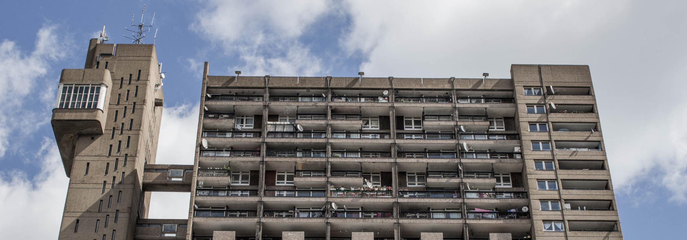

John Bentley Mays recently wrote a piece in the Globe, stating the case for saving the John Dickinson designed residential towers in Regent Park. He invited readers to send in proposals on how to save/re-purpose these buildings. I give him credit for raising awareness about preserving architecture - something that Canada has not been good at,. That said, it got me thinking about a similar building across the pond - Trellick Tower.
There are some interesting similarities. Both were designed by architects that followed and admired the French architect Le Corbusier, both were designed for families, both have two-story flats in them, both were social housing projects. So far so good, but then things unravel. Le Corbusier's ideas about social and communal living turned out to only appeal to him. People did not want to live the way he envisioned they would in his buildings. Essentially his vision is worthy of study, but ultimately, a fascinating flop. Both Trellick and the Regent Park buildings also have terrible histories with regard to poverty, crime and the laundry list of social ills that come with poorly planned social housing.

Even with all of that, Trellick has prevailed (depending on your view). Like many council properties across the UK, flats in Trellick were sold off to tenants and later on the open market. Trellick also has a Grade 2 Listing, meaning that it must be preserved. Although there are still council flats in the building and there is still crime and poverty, it's not known as "Terror Tower" anymore and it's flats command market price when they do come up for sale. That said, this in London and the building is in The Royal Borough of Kensington and Chelsea - some of the most valuable real estate in the world can be found here. Oh, and you can get a tea towel with this iconic building screen-printed on to it.

<figure class='full-width'>

<figcaption>TRELLICK TOWER</figcaption>
</figure>

Trellick Tower has another card up it's sleeve however - ***just look at it***. It's absolutely mesmerizing. It's a Tour de force of totally whack Brutalist architecture. It's separate tower for the lifts, it's gangways every second floor that connect the lifts tower to the main building, the "boiler room" at the top of the lifts tower that looks like an evil villain's laier, where plots to overthrow the free world are hatched and cocktails are served by ex-Olympic gymnasts from unknown eastern block countries - this building has it all.  It's such an ugly freak show of building that it's beautiful in a post-apocalyptic, steampunk kinda way.  It's extensive use in film and television bares this out - this place has a thing all it's own.

A few years ago Karen and I actually toured the inside Trellick Tower as part of a very cool thing called Open House London, where significant buildings were opened up for a limited amount of people to visit. Considering all that London has to offer architecture-wise, you would not think a council estate would be top of the list, but indeed they were running groups to explore this fascinating building. We count ourselves among the few Canadians that have entered it's doors - I'm sure some Brits would laugh at that. 

It was an experience to say the least. We went into two flats - a one bedroom owned by our guide and a two-story three bedroom that was also privately owned. The three bedroom in particular was interesting in that it benefited from a large balcony and windows on both the north and south sides of the building on one of the floors (the floor that does not have the gangway from the lift and common hallway.) Does the building succeed as a place where families can live in the sky? I don't know, but I do know that certain people will pay London prices to live there, build their lives and raise their kids.

Can the same be said for the buildings in Regent Park. I say no. Firstly, if Trellick Tower is "good ugly" the Regent Park buildings are "butt ugly ugly". I don't know if technically they would be considered in the Brutalist style or not, but they are not good examples of whatever style they belong to. The awkward mixture of brick and concrete, the off-putting lack of windows - it's all just nasty.

Secondly, privatizing them, if even possible, will not redeem then. Who would buy them? Do they even have a market value? The UK's history of social housing differs quite a bit from Canada's. We did not experience the Industrial Revolution and we did not have large parts of our country leveled by the Luftwaffe. Consequently, we've never had housing problems on the same scale and have little experience with selling off  large-scale public housing. Can you say money pit?

Still, Mays' core message seems to be about saving what he considers to be significant architecture, but is it? Well intentioned it may be, but given how ugly, unloved and infamous these buildings are, and on the other hand how well the rejuvenation of Regent Park is going, I say raze them to the ground.
