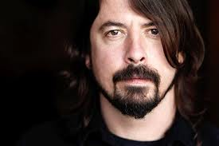

I say absorbed because much of the time I can’t remember how I came to know about something these days. Information just seems to come from so many different sources and is transferred into us in so many different ways, that it becomes just a blur. Messages overlap, repeat themselves, re-tweet themselves, go viral and generally don’t behave in any kind or orderly fashion. And as far as technology goes, we are just getting started. 

I am certain at some point in the not too distant future there will be a technology that determines your location from your phone and then sends a message to the seat you are currently sitting on. The seat will process the instructions and then commence to vibrate highly complex patterns into you. Your brain will process these vibrations and interpret them as a burning desire to pop into the local (insert fast food chain name here) and nosh down on a 4200 calorie snack. You will then exit the restaurant in that nauseous, lethargic state that Morgan Spurlock so accurately described in his movie Super Size Me. You will attempt to waddle home, give up and grab a cab.

Anyway....

Dave Grohl is a breath of fresh air. A self-deprecating journey-man rock and roller that gets it. He is a fan of The Beatles, Bruce Springsteen, Rush, every punk band from the beginning of time and Gangnan Style. As he relates in the speech, his path to success was about creating music exactly the way he wanted to, regardless of what people like A&R weasels might say. It was also about doing everything himself from writing and recording to getting the t-shirts made. His speech was partly a telling of his story and partly a call to musicians to give the music "industry" a swerve and instead roll their own careers. With the sense of liberation that brings and years of hard graft, you might just get somewhere and in the meantime, you'll be getting better at your craft instead of waiting for Simon Cowell to call. His hilarious comment about Bob Dylan and Christina Aguilera sums it up perfectly.

<iframe width="560" height="315" src="https://www.youtube.com/embed/Efv0Y5Fs7m4" frameborder="0" allowfullscreen></iframe>

