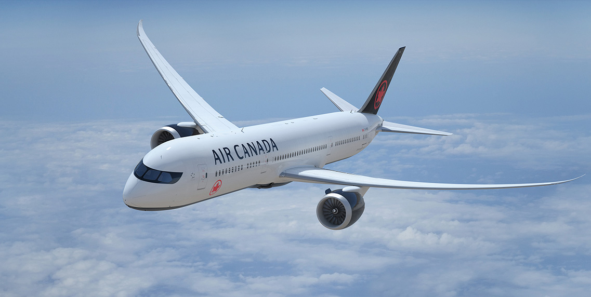
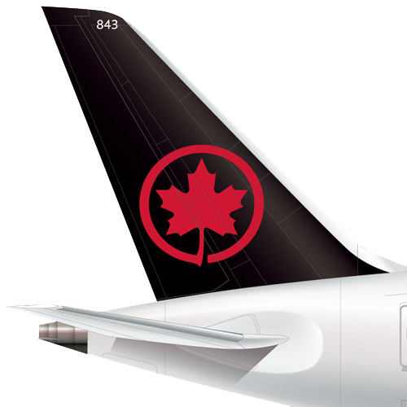
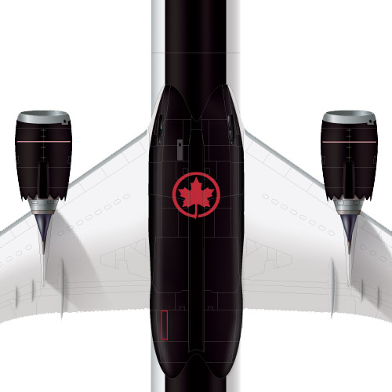
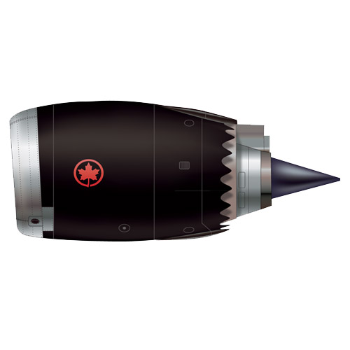
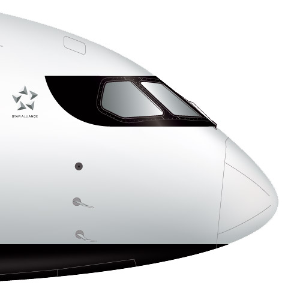

To many Canadians Air Canada is the company they love to hate. They lament the service, complain about delays, whinge about the cabin crew and heap scorn on the entire outfit. The rants are always accompanied by stories detailing some apparently traumatic mishap and end with a pronouncement by the victim that they will never fly the airline again - a tall order if you live here and want to travel the world. Air Canada is after all the country's only true international airline. That said, it’s unique status does not endear it to many Canadians. For many, hating Air Canada is as much a national pastime as hating Toronto and it’s mayor who once called in the army to shovel some snow.

The other side of the coin is of course quite different. Air Canada maintains a page on it’s site with no small amount of awards and accolades that’s it won over the last 25 years. It’s continued to offer full service flights to the four corners of the planet, maintained a current fleet and managed to survive in one of the toughest businesses there is. All in all not bad for a business that’s been close to the bust more than once. 

No doubt mindful of its curious dual-personality Air Canada has decided it’s time for a fresh coat of paint and introduced a new livery for its aircraft. To my eye, they absolutely nailed it. 

<figure class='full-width'>

<figcaption>AIR CANADA 787</figcaption>
</figure>

## How should you brand an airline?

The short answer is that there isn’t one. It goes far beyond the look of the planes and the scope of this article. Any biography of Richard Branson would be a good place to look for answers as few in recent memory have started from scratch and built as successful an aviation franchise. Yes fellow Canadians - there is of course your beloved WestJet. 

If Air Canada is the Toronto of airlines, with nothing good to be said about it, then it stands to reason that WestJet must the Tim Hortons of the skies. To many in the Great White North, getting on a WestJet flight is like sipping a double double while you watch the kids playing hockey at the local area - the perfect articulation of Canuck bliss. They are friendly, totally perfect in every way and better than any other airline anywhere at any time aye. I was once on a WestJet flight where the Captain, with great fanfare announced that it was the airline’s birthday. I naively thought this significant event might yield a free round of drinks for us on board. No dice. Silly me.

Still, you can’t deny WestJet’s success. They have found the special sauce and become a significant force in the marketplace. Their brand is all about the friendly skies at the right price - a good recipe no doubt. That said, they don’t really look like much. It’s fair to say that the visual aspects of WestJet’s brand - logo, livery, etc are nothing special at all. It’s all rather undistinguished and devoid of the friendly personality they embody in the flesh. Maybe it doesn’t really matter what they look like to their customers, as they are totally awesome - like wheeling straight up to the speaker at a Timmy’s drive-through is awesome, dude.

If it was only so simple for what used to be Canada’s official flag carrier. Back when Air Canada was a crown corporation (or ward of the state, depending on your view), it was a bit like WestJet’s situation - it didn’t really matter what it looked like. If you were going abroad or flying domestically, you were most likely flying AC. In it’s earliest days it had a total monopoly over the Canadian skies and while that set-up is long gone, it allowed the airline to establish its Flag Carrier status easily - stick a flag on it - job done.

Over the years that followed, the aviation industry deregulated and true competition came to the marketplace and with it came the full force of branding. Remember Canadian Pacific’s orange and red livery? With true choice in the marketplace, an airline’s visual identity mattered if for no other reason that it may be a contributing factor for putting bums in seats. There was also classy WardAir with it’s real cutlery and tableware. Ah the things you could do before bad guys took all the fun out of flying…

For many years, these were just some of the challenges that Air Canada faced. Beyond full-service competitors, there was the rise in package holidays and the charter flight business that it created to get everybody to their resort or cruise ship and back home again after a week of all-inclusive sun-drenched consumption. This was a low-margin business in an already low-margin business and not one best suited for a full service carrier with legacy issues like unionized staff and deeply embedded overhead.

Circa 2017 Air Canada has made its way through all this and finds itself as a bit of an elder statesman of the skies. It’s an interesting position and one that brings us back to the issue of the paint job. It’s a disservice to reduce a significant brand overhaul down to just being a new coat of paint. Certainly a great deal of work goes into these things before the planes get resprayed. But the result - the new livery itself is the interesting part. 

At first glance some people will most likely be underwhelmed. “What’s the big deal - it’s white plane”. It’s also been said said that it looks like Delta’s livery. Both are true to a point but more importantly, the new livery is simple, elegant, beautiful and deceptively timeless - all things that tie nicely into the elder statesman thing. Along with the stated brief of drawing inspiration from Canada’s spirit, culture and breathtaking natural landscapes, it would appear that Mies van der Rohe’s axiom “god is in the details” played its part. 

  

    <figure class='align-right'>
      
      <figcaption>Tail</figcaption>
    </figure>
  

  

    <figure class='align-center'>
      
      <figcaption>Belly</figcaption>
    </figure>
  

  

    <figure class='align-center'>
      
      <figcaption>Nacelle</figcaption>
    </figure>
  

  

    <figure class=''>
      
      <figcaption>Nose</figcaption>
    </figure>
  

The temptation to go big with aircraft livery must alway be in the background for those who do this design work. A plane is such a big, unique canvas to work with. Who wouldn’t want to design one and go a little berserk. It’s maybe the one canvas where a designer can truly indulge the client’s desire to make the logo bigger and not hate herself for doing it. 

Still it’s not like chucking out a box of business cards if you get the design wrong. A quick google for “cost to paint a plane” comes back with numbers ranging from 50K to 200K. Multiple that by the number of planes in a large fleet (300 in AC’s case) and you’ve got a substantial investment that will come under the scrutiny of customers, shareholders, competitors, plane spotters, art directors and your uncle Phil - who’s flying in from Thunder Bay. The design has to be right and it has to have longevity. It may not have to be as timeless as a great building, but it’s got to longer that a fashion designer’s spring collection. Air Canada’s new livery works because in our visually oversaturated world it’s not screaming for attention but also won’t look dated five or ten years from now.

