

Where’s that? is the question often fielded immediately after mentioning Merida. A city of a million people four hours from the tourist mecca of Cancun and people don’t seem to know about it. That’s just fine. It means no Señor Frogs, no Carlos and Charlies and no heaving crowds of hit and run tourists disgorged from an armada of cruise ships for the purpose of shock and awe cultural consumption. It means that Merida is a functioning city not beholden to tourism as its sole economy. And yet, there is much to see for the true traveller craving a unique experience.

We had known about the place for a while but had never made the schlep from our fav beach destination of Tulum. This year was to be different. Four nights in Merida were bolted on to the front end of the trip with the intention of experiencing Merida in all its colonial charm. First up was getting there and there was no schlep to be had. Instead it was one of the more pleasant passages in recent memory and it was on a bus. 

Platino is the flagship, luxury offering from ADO, the bus folks in this part of the world. For a journey of this length, it was truly better than flying. The journey begins at the main bus station in Cancun where you can pass the time before departure in a private air-conditioned lounge. A half hour before departure, they check you luggage! and you’re given a goodie bag and drink as you board. The coach itself is not your average Greyhound. The seats are so big they can only fit three per row and each one comes with a fold-down leg support and personal entertainment system. You can recline very comfortably in a big cushy seat, watch a Spanish dubbed Hollywood blockbuster and make up your own dialogue knowing your not far off the real script. Or you can just saw logs as the blackout curtains ensure you don’t bother trying to study the bland Yucatan countryside. Separate baños for mujeres and hombres and a drinks station at the back of the bus complete the Platino offering. Well, that was easy. Travel is so much better when it’s pleasant. Seems like a case of stating the obvious but how often have you arrived at your destination totally knackered, bedraggled and feeling a bit shit.

Merida is often described as a city of faded glory. Fair enough but that cliched byline doesn’t present the full story. There’s plenty of life in the old girl, she just doesn’t try to show it off all at once. Instead, she lets her true character reveal itself as you walk slowly through her streets. Slowly because it’s hot, slowly because some of the sidewalks are crowded and slowly because some are narrow. You can’t march around town like you’re joe suit legging it to your 8AM breakfast meeting. It doesn't work that way here. Instead you need to just let the city decide your pace.

If you appreciate architecture then this won’t be an issue. Having a leisurely trundle will allow you to see some beautiful buildings - both restored and crumbling. The restored buildings show what the city looked before ‘faded’ was added to ‘glory’, for the city was once indeed very glorious and prosperous. The restored buildings also provide the tantalizing answer to the question of ‘what if we bought one of these crumbling old haciendas and did it up?’ If you have the smallest shred of DIY in you, you can’t help but look at them and consider the possibilities. Even in the streets where most buildings have been done up, there is always a few derelict ones with big bones and endless potential just waiting to be snapped up. 

  

    <figure class=''>
      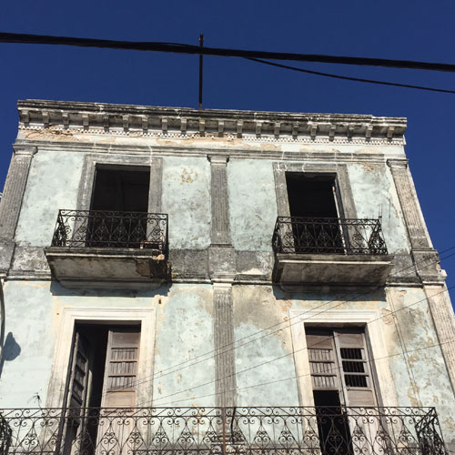
      <figcaption>fixer upper</figcaption>
    </figure>
  

  

    <figure class=''>
      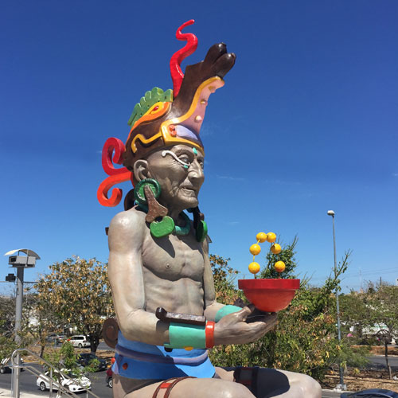
      <figcaption>the boss</figcaption>
    </figure>
  

  

    <figure class=''>
      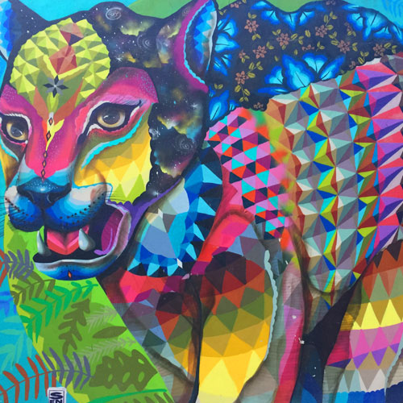
      <figcaption>street art (Tulum)</figcaption>
    </figure>
  

  

    <figure class=''>
      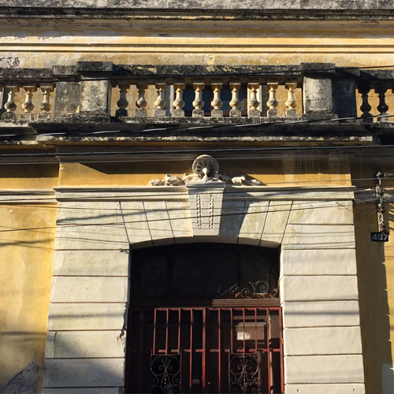
      <figcaption>faded glory</figcaption>
    </figure>
  

The other reason this temptation exists is price. By North American or European big city standards, property in Merida is an absolute steal. Looking online at what’s available is an exercise in anti-sticker shock. At the lowest end of the spectrum one listing’s cheeky lead-in blurb was “Purchase With Your Credit Card!”. Aiming a little higher up the property ladder yields listings of a good size in Centro for less than six figures. These are total gut jobs but fixer-uppers like these just don’t exist back home. At these prices you are not getting the finished article but you will get modest but elegant frontage in need of some love, high ceilings, generously proportioned rooms  and often a private courtyard or backyard ripe for conversation into a grand outdoor living space. If DIY is not your thing, renovated properties and new builds also come with prices that make you wonder why the price of property got so stupid back home.

One thing that never ceases to intrigue is the whole idea of blurring the lines between indoor and outdoor living. Up north we have no choice in the matter. We simply must delineate these spaces for most of the year or we’ll freeze our bits off - or the bugs will chew them off. Down south the rules change and the lines sometimes cease to exist. Our hotel room featured an outdoor shower that was not some way station on the way back from the pool. This was *the* shower. A proper room that just happened to be outside because it didn’t have to be inside. How refreshing.

Beyond entertaining personal home fantasies, Merida’s architecture is a reminder of just how old the city is. Even our old cities in North America don’t look as old as Merida, probably because they aren’t. What was going on in Manhattan in 1542 when the Spaniards set up shop in Merida? Probably not much. The Dutch didn’t spend their 60 guilders to buy the island from the American Indians until 1626. Merida’s cathedral is one of the oldest in the Americas and would not look out of place in France or Italy.

The town is comprised of barrios - a unit of urban-planning measure that generally has a church and public square as its nucleus and some blocks of homes and buildings surrounding it. The city is built on a simple grid system with even numbered streets running north-south and odds running east-west. Paseo de Montejo is a wide grand boulevard lined with opulent buildings. Even here there are building opportunities to be had, although on a different level. If you are a hotel impresario looking to snap a regal colonial mansion and turn it into a twenty-first century palace of hipsterdom worthy of a feature in Conde Nast, this is the street to buy on. 

  

    <figure class=''>
      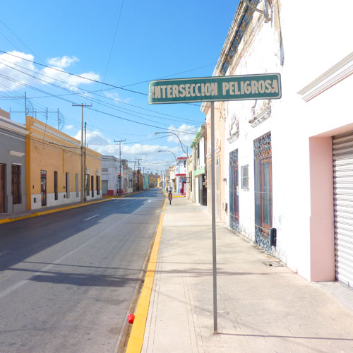
      <figcaption>dangerous intersection</figcaption>
    </figure>
  

  

    <figure class=''>
      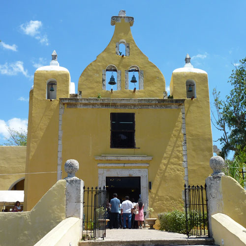
      <figcaption>Ermita church</figcaption>
    </figure>
  

  

    <figure class=''>
      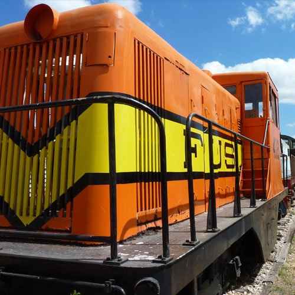
      <figcaption>not in service</figcaption>
    </figure>
  

  

    <figure class=''>
      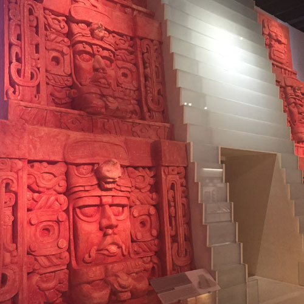
      <figcaption>temple recreation</figcaption>
    </figure>
  

It’s an interesting dichotomy to be in a big city with a slower pace. Yes there are lots of people coming and going, working and getting through their day, but the pace seems far more human than what we northern big city dwellers subject ourselves to on a daily basis. Traffic seems to move a decent rate - not too slow and not too fast - even though the streets are all one way. The  central market is a buzzing warren of hundreds of stalls selling everything from fish to flip flops to lunch. As with any market it is a busy place, but you don’t feel rushed like you do in other markets where many merchants have a bit of soup nazi about them. Quite the opposite, one taco stand operator had hand wash in his holster, ready to give you a squirt after you finished his yummy nosh.

Markets are always a place to visit no matter where you go. No other places offer the immediate sensory overload of a busy market and Merida’s is no exception. Merida’s close proximity to the port town of Progreso means seafood is fresh and plentiful and the market has a dedicated area for it’s fish mongers. All manner of creatures of the deep were on offer and the requisite gato was in attendance, looking for lunch. There are other areas dedicated to various retail verticals - the spice area, the meat area and the tortilla area where the onsite tortillas factory sells this staple at the government mandated price of 15 pesos per Kg. 

The slow drip of Merida’s charms continued throughout our visit. Every morning the city runs free, guided walking tours that provide a great introduction to the city's history, and the shared histories of the Spanish and Mayan people that inhabit it. The tour doesn’t really go much further than the main square but there is more than enough to take in.

On the east side of town is the city's train museum, although it truth it’s not government run at all. Sitting on a plot on the south end of the old rail yard, the museum exists because some train workers and transporters decided to built in. The attendant on station (did you get that?)  the day we visited was a history teacher who volunteered his time on weekends to man the switch (ok I’ll stop now). Between talking to visitors he spends his time working on restoring the rolling stock in the collection. Hand sanding vast expanses of steel under a midday sun - that is an enthusiast. The collection of cars and engines were of various vintages with most in a fairly dilapidated state. Again this is not some government-funded thing. Still it’s interesting spelunking around in the rotting carcass of what was once a glorious first-class car with private cabins. It felt like being in a movie - just before you notice the corpse in the corner and some super-scary shit kicks off.

On the other end of the cultural spectrum is the brand new Museum of the Maya. Situated in the northern suburbs, it’s about 20 minute cab ride from Centro, but well worth it. Fascinating stuff. If Merida is an old city by north american standards, the Maya are an ancient society by anybodies’ standards. Over three thousand years, the Maya built a society complete with all the foundational elements of we expect in an advanced civilization. Their society occupied vast swaths of what is now Mexico, Belize, Guatemala and Honduras. They had functioning economies, cities built by architects and planners and a hierarchical society with leaders, soldiers, artisans and a professional class. 

The standard question used to be why did the Mayans disappear? The museum’s contention is that they never did. While there was a period when their cities were vacated, the people themselves were never extinguished. Indeed questions like ‘what did the Maya look like?’ are simply answered with ‘the same as they do now’. This idea is also in evidence by the way the museum is laid out. Before getting to the collection there is a short film that introduces the hypothesis that the meteorites that ultimately caused the ice age landed in and around what is now the Yucatan Peninsula. While that is certainly starting at the beginning, the rest of the museum is organized in a non-chronological order. Items and installations reflecting recent history are mixed with others from the distant past - the idea being that the Maya are not solely some historical society. 

Back in town the local offering of culture continued to reveal itself at a leisurely pace. A nice side effect of the city not being totally beholden to tourism is the food offering. As mentioned up top, it’s not about the standard issue chains designed to appeal to gringo tourists. Local food culture is alive and well in Merida where excellent Yucatan cuisine can be had at very reasonable prices. There is also a decent offering of food from other places including Escargot - a hole in the wall knocking our excellent croissants and other French patisserie standards. There’s also a modern-day hawker market where you can find global street food and bevies and a great vibe to consume them in.

One morning while exploring the town we walked past two local boys in their early teens. One of them had on a t-shirt that said FUCK THE RULES in large letters. I missed the photo-op, but was left wondering what they thought it meant. Was it just a bit of teenage rebellion directed at everything teens typically dislike, or were they worldly enough to see the geo-political applicability of this sentiment given the new POTUS’s agenda one country to the north? No such ambiguity existed for the gringo tourist at the bus station sporting the F*CK TRUMP hat. This souvenir was no doubt designed and sold in Mexico, probably made in China and in the possession of an American (probably a Hillary fan still licking her wounds).

  

    <figure class=''>
      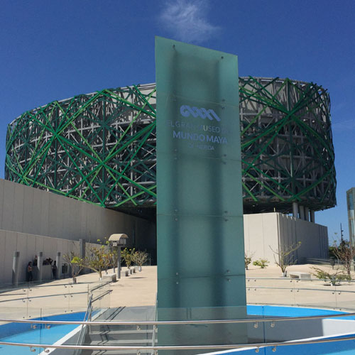
      <figcaption>Museum of the Maya</figcaption>
    </figure>
  

  

    <figure class=''>
      
      <figcaption>not a fan</figcaption>
    </figure>
  

  

    <figure class=''>
      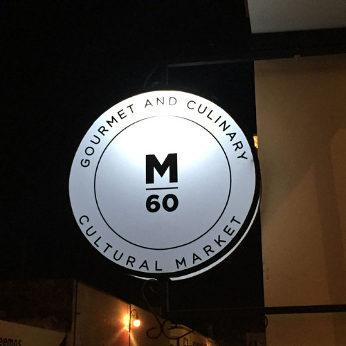
      <figcaption>street food market</figcaption>
    </figure>
  

  

    <figure class=''>
      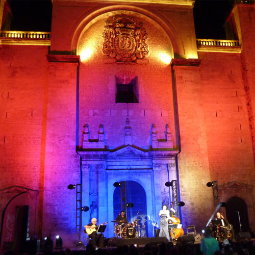
      <figcaption>music in front of the cathedral</figcaption>
    </figure>
  

Having said all that, the awkward and off-putting politics of the moment did not make their presence known to us by the locals. They have lives to lead and probably can’t be bothered with it all. Good on them. One million less followers for Agent Orange’s twitter account.

The town square as a center of local culture and community is great aspect of live in Merida. Merida is the Cultural City of The Americas for 2017 and the city has a calendar of events to go with it. On saturday night, in front of the beautiful cathedral we took in a free concert of excellent latin jazz. The show was well attended by locals all ages and the nice breeze and genteel atmosphere made the event that much more enjoyable. We exchanged pleasantries with an older local couple sitting next to us, the language barrier proving to be no barrier to civility and good will.

