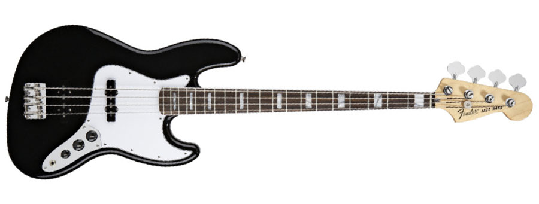
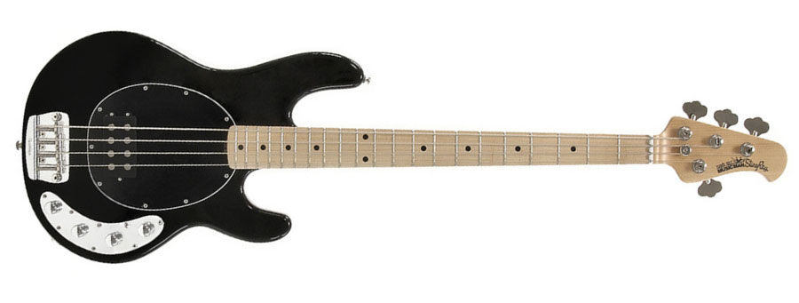
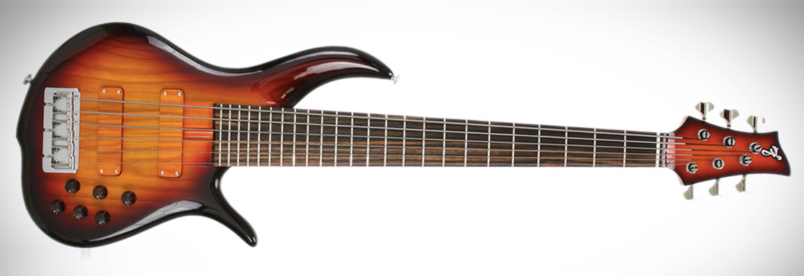
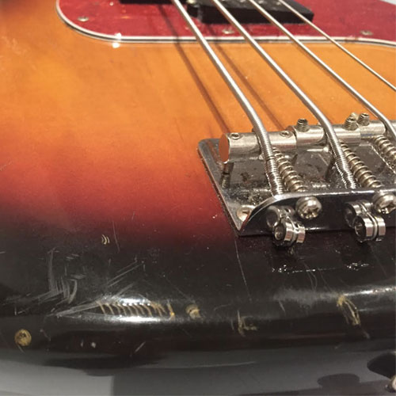
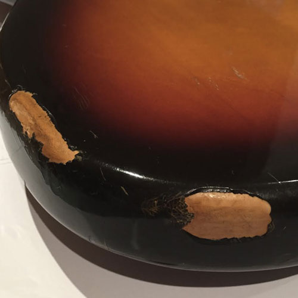
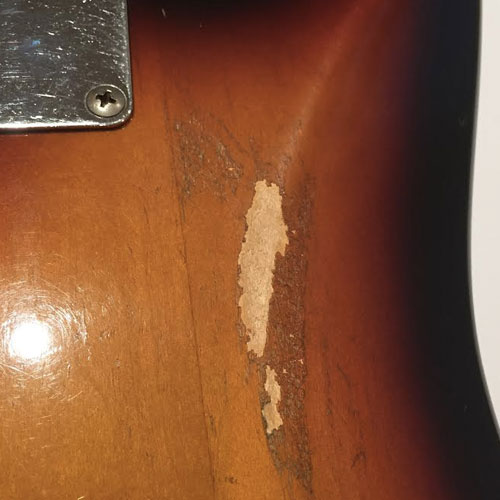
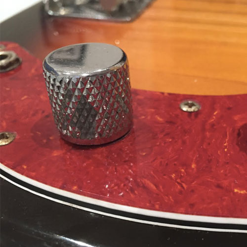

I bought a 1992 reissue of a 1962 Fender Precision Bass. It’s old enough and beat up enough to have history and personality and along with being made at Fender’s highly regarded Japanese factory, it literally came from Japan via eBay. Buying an instrument online is a bit of a leap of faith - even more so when the seller is on the other side of the world. I had never done it before, but here we are.

The p-bass is the original electric bass. The original low frequency sound of most electric music you know and love - rock, soul, country, jazz, polka ah… not sure, but you get the idea. The p-bass is the warm, familiar, durable sound of many of your favourite tunes. The list of famous songs, albums and bass players associated with the p-bass is epic. Motown, Stax, british invasion, 70’s glam rock, 70 soul and R&B, funk, disco, prog rock, roots rock, metal, grunge, alternative, jazz - the p-bass has been a huge part of all of that. In early days the ‘electric bass’ was often referred to simply as ‘Fender bass’ - so synonymous and dominant it was.

A reviewer in a recent Bass Player Magazine did a good job of explaining the sound of the electric bass. He stated that there are really only three different types of electric bass sounds: the Fender Precision bass, the Fender Jazz bass and the MusicMan Stingray. His contention being that all the other basses made by hundreds of different manufacturers are, sound-wise, derivative of one of these three. Many would argue this point, but as a general rule of thumb it stands up. There are a few interesting parts to this point of view. All three instruments were designed by Leo Fender - the P and J were designed when Leo was Fender and the Stingray was designed by Leo after he sold Fender to CBS and started the MusicMan company. The other key factor are the pickups. Each one of these three instruments has a unique pickup design that is a major part of the instrument’s inherent sound. 

  

    <figure class="align-right">
      
      <figcaption>Fender Jazz</figcaption>
    </figure>
  

  

    <figure class="align-center">
      
      <figcaption>MusicanMan Stingray</figcaption>
    </figure>
  

Chronologically, first up was the p-bass with it’s split coil humbucking pickup. There was a precursor to the split coil, but the split coil is the iconic sound of the p-bass.  Mounted in the middle of the area between the end of the neck and the bridge, the p-bass pickup provided a warm, round sound. For many musicians, arrangers and producers, the p-bass and it’s novel pickup was the first viable alternative to an upright acoustic bass.

In the sixties, Leo went on to develop the Jazz bass with its two single coil pickups. This instrument provided a much wider variety of tones. While the front or neck pickup was in approximately the same position as the p-bass pickup, the back or bridge pickup was closer to the bridge, where the strings are tighter. With each pickup having it’s own volume pot, players could create a wide variety of new sounds not available on the p-bass. The single coil pickup itself was also a much different beast compared to the humbucker on the p-bass. It was more precise-sounding and allowed players to play in a busy, staccato style.

By the time Leo started MusicMan, both of his previous creations where iconic instruments. I don’t know this to be true, but it seems to me that maybe Leo thought is was time to go a little bonkers with the design of his next bass. The MusicMan Stingray was unlike any instrument before it primarily because of it’s huge humbucking pickup. This was not the bass created for playing 70’s elevator music. This thing could shred. With it’s onboard preamp and big pickup positioned for the right blend of bite and punch, the Stingray could take on a guitar player with a distortion pedal and a big Marshall stack.

San Francisco bass legend Bobby Vega claims every bass has a story. Over the years I have owned all three of these instruments although my journey started in reverse order. My first quality bass was a beautiful translucent red Stingray. The great bass player Tony Levin was my inspiration for wanting it. He made the Stingray his sound and still uses them to this day to create amazing bass lines. I played it at school and took it on the road. I played it through a big powerful amp for years and loved it. 

Next came the lure of the Jazz bass. As much as I loved the Stingray, I was finding it a bit one-dimensional. As awesome as it sounded, it was time for a change. At the time, I was playing in a band that rehearsed in Hamilton, in a room above George Furlanetto’s shop. George is the master luthier behind F Bass - easily one of the best bass builders in the world. Seeing all these beautiful instruments being built every week was like being a kid in a candy store, except this candy was not priced for kids. I was not in a position to purchase one of George’s bespoke basses, but I approached him about building me a Jazz bass from parts. Amazingly he said yes. It was nothing fancy - aftermarket swamp ash body and maple neck, emg pickups and off-the-shelf hardware. 

  

    <figure class="">
      
      <figcaption>The state of the art - F Bass BN6</figcaption>
    </figure>
  

That bass is about thirty years old now and sounds fantastic. I had stopped playing it for a few years, but when I came back to it, it seemed to have taken on a new sonic character. There is debate about how much the wood used in an electric instrument contributes to the sound of the instrument. Some people believe it’s key to the sound while others say the electronics and pickups are what really defines the sound. I will say this much - old wood is good wood. After thirty years of aging (drying really) my Jazz bass has a fantastic tone that I don’t remember from the early days.

There is one other aspect of that story that needs mentioning. I had put some money down on the bass when George started the build. When it was done I was just about to go on the road and didn’t have the balance to pay for the bass. George said “take it and pay me when you get back.” What? Who does that? It was incredibly decent of George to trust me - a guy in his early twenties - with a brand new instrument that was not fully paid for. George is a stand up guy..

Over the years I’ve had a few other instruments - a fretless bass and a six-string bass with a carbon composite neck. Both are challenging instruments to play, but good fun just the same and both provided the incentive to get back to playing jazz. The p-bass on the other hand is different. 

When I was gigging regularly (a long while ago now), I never really thought about the p-bass that much. Sure it could have worked, but I was playing the Jazz bass and enjoying it’s slim fast neck and great tone. Much of the music I love is also played by iconic Jazz bass players like Marcus Miller. Recently though, I began to hear newer music and players using the p-bass. Snarky Puppy’s Michael League and Tim Lefevre fall into that camp for me. Both of these guys have plenty of chops but they are not chops players. They are more interested in crafting bass lines that fit into the whole rather that standing out. That of course is the fundamental role of the bass in the first place, but when you are a bass player yourself, you can get sidetracked listening to technical masters like Jaco Pastorius and Victor Wooten.

When you stop focusing on the chops stuff and start thinking about bass in its principle context as the rhythmic and harmonic foundation for music, you can’t help but come straight back to the p-bass. Take an album like Fleetwood Mac’s Rumours - John McVie’s bass and Mick Fleetwood’s drums just lock in and create the perfect foundation for those great songs. Same deal with Roger Waters in Pink Floyd and Sting back in the Police days. All groove, all p-bass, all the time.

So with that, I set about trying to find one that fit the bill. I didn’t really consider buying new. I find new instruments too precious. You end up being overly concerned about them getting dings and scratches and bumps and bruises. I’m more interested in instruments that have been been played a lot even if they have the scars to prove it. All the better as no doubt I will add a few more. In the aftermarket instruments in pristine condition command the highest prices as you would expect, but there are folks that see the beauty and value in old warhorses. In fact instrument makers including Fender now make ‘reliced’ instruments whereby the manufacturing process includes subjecting the instrument to various types of abuse to give it the appearance of being old and well-used. I’m not sure how I feel about that. I like the look, but I don’t think I would buy one.

  

    <figure class="align-right">
      
      <figcaption>scratch</figcaption>
    </figure>
  

  

    <figure class="align-center">
      
      <figcaption>bump and bash</figcaption>
    </figure>
  

  

    <figure class="align-center">
      
      <figcaption>scrape</figcaption>
    </figure>
  

  

    <figure class="">
      
      <figcaption>flake</figcaption>
    </figure>
  

At any given time in our global marketplace there are probably hundreds if not thousands of used p-basses for sale, but I initially kept my search close to home. There was a few contenders but nothing that stood out as the one. Still, the time looking was well spent as I got a good sense of the market. When I started looking further afield I noticed that it truly is a global marketplace these days. Once you factor in shipping etc, it seems to me that prices seem pretty similar even as far away as Japan - and that’s where I found her. Well, I found her on eBay to be fair, but she was made in Japan and still there 25 years after she was built. The seller had a solid rep on both eBay and reverb.com and the bass itself was exactly what I was looking for. The pictures tell the story. She’s a three-colour burst with a maple neck and rosewood fingerboard. Of all the different combinations of colours and finishes that Fender produces, this is one of the true classics. 

 I wonder what her story is. Who owned her before me? A kid in a Tokyo punk band? A music store that rented her out to a thousand different players? A series of different owners playing all kinds of different music? How many different gigs in how many different clubs and bars has she been played in? How many recordings has she been played on? Then again maybe she was just owned by somebody who playing in a garage band. As much as I’ll never know her complete past story it doesn’t really matter. A new chapter of her life began a few months ago when she traveled all the way across the Pacific Ocean to live in Canada.

